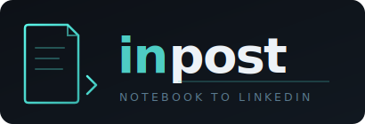

<p align="center">
  
</p>

# InPost

Multi-notebook to LinkedIn publishing pipeline with AI-powered content transformation.

InPost fetches blog posts from **Notion, Obsidian, OneNote, or Evernote**, transforms them into LinkedIn-optimized content using AI, and publishes them via the LinkedIn API — all from the command line.

## Features

**Multi-Notebook Support**
- Fetch content from Notion, Obsidian, OneNote, or Evernote
- Switch providers with `--notebook <provider>` or shorthand flags (`--notion`, `--obsidian`, etc.)
- Set a default provider via `DEFAULT_NOTEBOOK` in `.env`

**Automated Pipeline**
- Fetch Notion pages marked "Ready"
- Convert Notion blocks to LinkedIn-compatible text
- Publish to LinkedIn via API
- Update Notion with LinkedIn URL + published status
- Log analytics and errors

**AI Content Transformation**
- Blog → LinkedIn summary
- Attention-grabbing hooks
- Tone rewriting (professional, casual, authority, storytelling, educational)
- Auto-generated hashtags
- Thread splitting for long content
- Multiple post variants

**Multi-Provider AI Support**
- **Groq** (recommended) — 14,400 free requests/day
- **Google Gemini** — Free tier available
- **Anthropic Claude** — Paid

## Prerequisites

- Node.js 20+
- A [Notion integration](docs/notion-setup.md) with database access (if using Notion)
- A [LinkedIn Developer App](docs/linkedin-setup.md) for publishing
- An AI API key (Groq, Gemini, or Anthropic)
- Note provider credentials (see [Note Providers](#note-providers) below)

## Quick Start

```bash
# Copy and fill in your credentials
cp .env.example .env
# Edit .env with your API keys (see Configuration below)

# Install, build, and link globally
./setup.sh

# Check your configuration
inpost status

# Authenticate with LinkedIn
inpost auth

# Transform content from any provider
inpost transform "Your blog content here"
inpost transform --notion-title "My Post" -i
inpost transform --obsidian-title "My Note" -i --save
inpost transform --onenote-title "My Page" -i --save
inpost transform --evernote-title "My Note" -i --save

# Publish to LinkedIn
inpost publish "Your LinkedIn post text"
inpost publish --obsidian-title "My Note"

# Full pipeline: fetch → transform → publish
inpost pipeline --dry-run

# Get help for any command
inpost transform ?
inpost schedule ?
```

## Commands

| Command | Description |
|---------|-------------|
| `inpost transform [text]` | Transform content for LinkedIn |
| `inpost publish [text]` | Publish content to LinkedIn |
| `inpost pipeline` | Full pipeline: fetch → transform → publish |
| `inpost fetch` | Fetch posts from Notion by status |
| `inpost auth` | Authenticate with LinkedIn (or OneNote) via OAuth |
| `inpost schedule` | Run pipeline on a cron schedule |
| `inpost status` | Check configuration and connection status |

Append `?` to any command for contextual help, e.g. `inpost transform ?`.

### Transform

```bash
inpost transform "Your content here"
inpost transform --notion-id <id>
inpost transform --notion-title "My Post"
inpost transform --file ./post.txt

# Other note providers
inpost transform --obsidian-title "My Note"
inpost transform --onenote-title "My Page"
inpost transform --evernote-title "My Note"

# Interactive mode - refine with feedback
inpost transform "Your content" -i

Options:
  -t, --tone <tone>             Tone (defaults to DEFAULT_TONE in .env)
  -i, --interactive             Refine output with feedback loop
  --variants <count>            Number of variants to generate
  --hooks                       Generate attention-grabbing hooks
  --hashtags                    Auto-generate hashtags
  --thread                      Split into LinkedIn thread
  --save                        Save result back to the note source
  --json                        Output as JSON
  --notebook <provider>         notion | obsidian | onenote | evernote
  --notion | --obsidian | --onenote | --evernote   Provider shorthands
  --title <title>               Note title (used with --notebook)
  --id <id>                     Note ID (used with --notebook)
```

**Interactive mode** lets you refine the output:
1. View the generated post
2. Choose: Accept, Provide feedback, Regenerate, Help, or Cancel
3. If feedback: describe changes (e.g., "make it shorter", "add a question")
4. Review the refined version
5. Repeat until satisfied

### Publish

```bash
inpost publish "Your LinkedIn post"
inpost publish --notion-id <id>
inpost publish --obsidian-title "My Note"
inpost publish --onenote-title "My Page"
inpost publish --evernote-title "My Note"

Options:
  --dry-run                     Preview without posting
  --connections                 Limit visibility to connections only
  --no-update-notion            Skip updating Notion after publishing
  --notebook <provider>         notion | obsidian | onenote | evernote
  --notion | --obsidian | --onenote | --evernote   Provider shorthands
  --title <title>               Note title (used with --notebook)
  --id <id>                     Note ID (used with --notebook)
```

### Pipeline

```bash
inpost pipeline
inpost pipeline --dry-run

Options:
  --status <value>      Notion status to fetch (default: "Ready")
  --limit <number>      Maximum posts to process (default: 5)
  --tone <tone>         Default tone for AI transformation
  --hooks               Include hooks in generated content
  --hashtags            Include hashtags
  --dry-run             Run everything except actual LinkedIn publish
  --no-confirm          Skip confirmation prompts
  --notebook <provider> notion | obsidian | onenote | evernote
```

### Fetch

```bash
inpost fetch
inpost fetch --status Ready
inpost fetch --all --limit 20

# Fetch from a specific provider
inpost fetch --obsidian --all
inpost fetch --notebook onenote --all

Options:
  --status <value>      Status filter (default: "Ready")
  --limit <number>      Max results to return
  --all                 List all posts regardless of status
  --notebook <provider> notion | obsidian | onenote | evernote
  --notion | --obsidian | --onenote | --evernote   Provider shorthands
```

### Schedule

```bash
inpost schedule
inpost schedule --once
inpost schedule --cron "0 9 * * 1-5" --timezone "America/New_York"
inpost schedule --limit 2

Options:
  --once                Run immediately instead of on a schedule
  --cron <expression>   Cron expression (overrides SCHEDULE_CRON in .env)
  --timezone <tz>       Timezone (overrides SCHEDULE_TIMEZONE in .env)
  --limit <number>      Max posts per run (overrides SCHEDULE_LIMIT in .env)
```

### Auth

```bash
inpost auth             # Authenticate with LinkedIn
inpost auth --onenote   # Authenticate with Microsoft (OneNote)
```

## Note Providers

InPost supports four note sources. See [docs/note-providers.md](docs/note-providers.md) for full setup instructions.

| Provider | Auth | Setup |
|----------|------|-------|
| **Notion** | API token | [docs/notion-setup.md](docs/notion-setup.md) |
| **Obsidian** | None — reads local vault files | [docs/obsidian-setup.md](docs/obsidian-setup.md) |
| **OneNote** | OAuth via Azure AD | [docs/onenote-setup.md](docs/onenote-setup.md) |
| **Evernote** | Developer token | [docs/evernote-setup.md](docs/evernote-setup.md) |

### Provider flag reference

All provider flags work identically across `transform`, `publish`, `fetch`, `pipeline`, and `status`.

| Flag | Provider |
|------|----------|
| `--notion-title <title>` / `--notion-id <id>` | Notion |
| `--obsidian-title <title>` / `--obsidian-id <path>` | Obsidian |
| `--onenote-title <title>` / `--onenote-id <id>` | OneNote |
| `--evernote-title <title>` / `--evernote-id <guid>` | Evernote |

## Configuration

### Environment Variables

```bash
# Required: Notion (if using Notion)
NOTION_API_TOKEN=ntn_xxx
NOTION_DATABASE_ID=xxx-xxx-xxx

# Required: AI Provider (set at least one)
GROQ_API_KEY=gsk_xxx          # Recommended - best free tier
GEMINI_API_KEY=AIza_xxx       # Free tier available
ANTHROPIC_API_KEY=sk-ant-xxx  # Paid

# Required for publishing: LinkedIn
LINKEDIN_CLIENT_ID=xxx
LINKEDIN_CLIENT_SECRET=xxx

# Optional
DEFAULT_TONE=professional
LOG_LEVEL=info
DEFAULT_NOTEBOOK=notion        # notion | onenote | obsidian | evernote

# Scheduler
SCHEDULE_CRON=0 11 * * 1       # Default: Mondays at 11am
SCHEDULE_TIMEZONE=Europe/London
SCHEDULE_LIMIT=1               # Max posts per scheduled run

# Obsidian (no API key needed)
OBSIDIAN_VAULT_PATH=/Users/you/Documents/MyVault
OBSIDIAN_NOTES_DIR=Blog Posts  # optional — scope to a subdirectory

# OneNote (requires Azure AD app)
ONENOTE_CLIENT_ID=
ONENOTE_CLIENT_SECRET=
ONENOTE_TENANT_ID=consumers
ONENOTE_REDIRECT_URI=http://localhost:3456/callback

# Evernote (requires developer token)
EVERNOTE_TOKEN=
EVERNOTE_NOTEBOOK=             # optional — scope to a specific notebook
EVERNOTE_SANDBOX=false
```

### AI Provider Priority

InPost auto-selects the AI provider based on available keys:
1. **Groq** (if `GROQ_API_KEY` set) — Fastest, best free tier
2. **Gemini** (if `GEMINI_API_KEY` set) — Good free tier
3. **Anthropic** (if `ANTHROPIC_API_KEY` set) — Highest quality, paid

## Notion Database Setup

Your Notion database needs these properties:

| Property | Type | Purpose |
|----------|------|---------|
| Name | Title | Post title |
| Status | Select | Draft / Ready / Transforming / Publishing / Published / Error |
| LinkedIn URL | URL | Filled after publishing |
| Published Date | Date | Filled after publishing |
| Tone | Select | AI tone override per post |
| Tags | Multi-select | For hashtag generation |
| AI Summary | Rich text | AI-generated LinkedIn post |
| Variants | Rich text | Multiple post variants |
| Error Log | Rich text | Error details |

See [docs/notion-setup.md](docs/notion-setup.md) for full setup instructions.

## Development

```bash
npm run dev -- status          # Run in dev mode
npm test                       # Run unit tests
npm run test:watch             # Watch mode
npm run typecheck              # Type checking
npm run lint                   # Lint
```

## License

MIT
